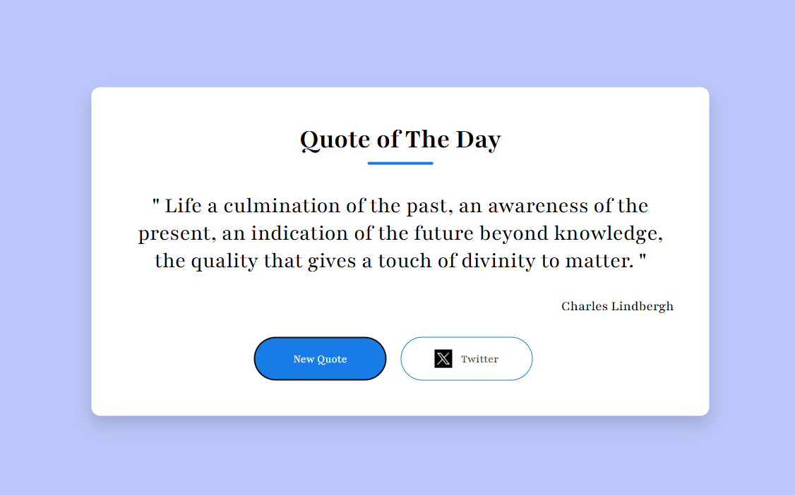

# Quote Generator
Get inspired with a click!
This simple tool delivers  quotes to uplift, motivate, or make you think—perfect for developers, creatives, or anyone who enjoys a dose of wisdom.

---

<!-- Project Link -->

🚀 **Try it now:** [Generate your quote instantly!](  )

<!-- Project Image -->

<p align="center">
  
</p>

---

A simple and customizable Quote Generator built with **HTML** **CSS** and **JavaScript**.

## ✨ Features

📜 Endless Inspiration: Get a new  quote with every click
🖼️ Clean UI: Minimal and visually appealing design
🔁 Instant Refresh: Load new quotes without reloading the page
🧠 Curated Content: Displays motivational, philosophical, or humorous quotes
📱 Responsive Design: Works on both mobile and desktop

## 🚀 Getting Started

### Installation

1. **Clone the repository:**
   ```
   git clone https://github.com/your-username/Quote-Generator.git
   cd -Quote-Generator
   ```

2. **Running the App**

Start the development server:
```
    Go Live
```
Open [http://127.0.0.1:5500](http://http://127.0.0.1:5500) in your browser to get started!


## 📝 Usage

1. Open the app in your browser.
2. Click the "New Quote" button to generate a  quote.
3. Share your favorite quotes via copy or social sharing features.

## 🎨 Customization

- Add your own collection of quotes in the JavaScript file.
- Customize fonts, colors, or layout in the CSS.
- Enhance with features like tweet/share quotes.

## 📄 License

This project is licensed under the MIT License.

---